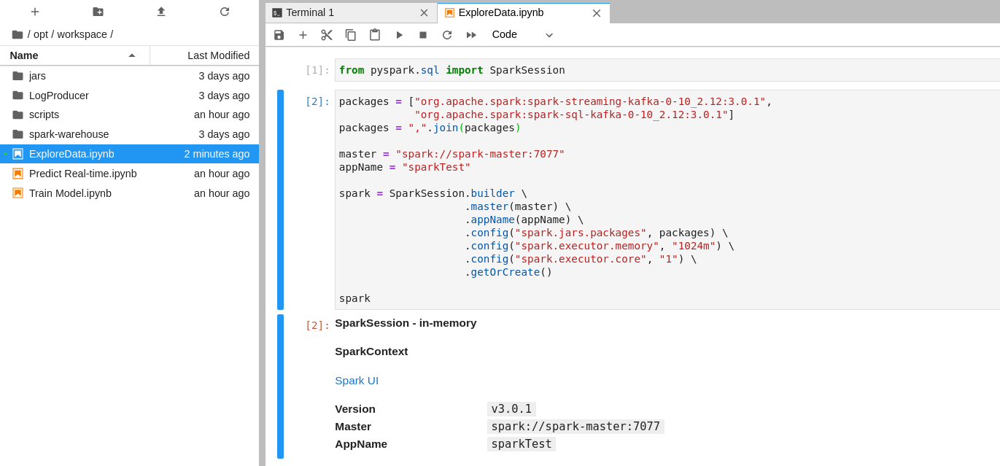

# GGTraceStreaming

`version`: 1.0

## Mô tả

### Mục đích

Project cho môn học big data, thực hiện mô phỏng hệ thống log dữ liệu của cụm máy chủ Google, với bộ dữ liệu do Google cung cấp, được mô tả đầy đủ ở [cluster-usage trace format schema](https://uni2u.tistory.com/attachment/cfile30.uf@26542633597592552C15C1.pdf).

Hệ thống sẽ mô phỏng quá trình ghi lại thông tin trạng thái của tài nguyên được sử dụng trong data center, sau đó sử lý dữ liệu log bằng các công cụ hỗ trợ làm việc với dữ liệu lớn, cụ thể trong project này là Hadoop, Kafka, Spark.

### Kiến trúc hệ thống

Luồng dữ liệu được di chuyển theo thứ tự:

1. Bộ mô phỏng lấy dữ liệu trạng thái của máy tính trong bộ dữ liệu Google Trace. để tạo ra dữ liệu log và gửi lên Kafka server theo dạng streaming.
2. Bộ xử lý dữ liệu sẽ lấy dữ liệu từ server Kafka và xử lý theo kiến trúc lambda, gồm 2 phần chính:
    - Batch Layer: Nhận dữ liệu từ Kafka server và lưu lại vào hệ thống Hadoop
    - Speed Layer: Xử lý dữ liệu trong thời gian thực

Dưới đây là component diagram của hệ thống:  


Ngoài ra, ta còn có thêm `ModelTrainer` để đưa ra các mô hình học nhằm phục vụ việc dữ đoán dữ liệu real-time ở Speed Layer.

## Cài đặt

Ta sẽ cài đặt hệ thống trên cụm docker container.

```
kafka bootstrap server: kafka:9092
hadoop default FS: hdfs://hadoop-namenode:8020
spark master: spark://spark-master:7077
spark master gui: localhost:8080
```

### Yêu cầu

```
docker-compose >= 1.27.4
docker >= 19.03.12
```

### Cài đặt cluster

#### Tạo các image cần thiết

```bash
bash build_images.sh
```

#### Hadoop Server

_Tạo cụm hadoop_

```bash
cd BigDataCluster/hdfs_system/
bash run.sh
```

Sau khi khởi động hệ thống hdfs thì terminal sẽ chuyển đến terminal của hệ thống hadoop, tại đó, ta có thể tạo các thư mục cần thiết.

_Tạo đường dẫn chứa dữ liệu_

```bash
hdfs dfs -mkdir /data
hdfs dfs -chmod 777 /data
```

#### Cài đặt cụm cho hệ thống

_Mở một terminal khác ở project `/GGTraceStreaming`_

```bash
cd /BigDataCluster
docker-compose up
```

Truy cập [localhost:8888](localhost:8888) để vào Jupyter Lab, [localhost:8080](localhost:8080) để xem Spark Master.

Trong file browser của jupyter lab, mở folder ở đường dẫn _`/opt/workspace/`_. Copy thư mục **jars**, **LogProducer** và **scripts** ở local _`GGTraceStreaming/`_ vào thư mục workspace. _(Do không upload trực tiếp được thư mục nên có thể nén thành file zip rồi dùng unzip để giải nên, chú ý là trong Launcher có terminal.)_

Hình ảnh sau khi upload:


#### Batch Processing

Vào thư mục scripts

```bash
cd /opt/workspace/scripts
```

Chạy batch layer để sẵn sàng nhận dữ liệu

```bash
bash run-batch-layer.sh
```

Cần chạy `LogProducer` để tạo ra dữ liệu.

Ta đang cần nhiều dữ liệu để lưu vào hệ thống nhằm phục vụ cho việc tạo model, nên ta sẽ đẩy nhanh quá trình này. Trong file `run-logger.sh`, sau lệnh `python main` là 2 số nguyên:

-   Số thứ nhất là số lượng record được gửi trong một lần gửi lên Kafka server
-   Số thứ 2 là quãng thời gian giữa 2 lần gửi.

Ở đây đang để là `3 5`, ta sửa lại là `5000 5`, và đợi khi nào gửi được khoảng 20000 record, tức 4 lần gửi thì dừng lại.

Đây là quá trình khởi tạo dữ liệu cho việc xây dựng model, sau khi khởi tạo xong thì đặt lại tham số là `3 5` hoặc tùy ý, nhưng đủ nhỏ để dễ quan sát.

Chỉnh xong tham số thì chạy bộ mô phỏng gửi dữ liệu log. Chú ý ta có thể mở nhiều terminal vì `LogProducer` và `BatchLayer` chạy song song.

```bash
bash run-logger.sh
```

Sau khi nhận đủ dữ liệu (tức bộ `LogProducer` gửi được khoảng 20000 messages) thì dừng lại cả `LogProducer` và `BatchLayer`.

Lúc này, dữ liệu của ta đã có ở trong thư mục `/data/` trong hadoop, ta có thể xây dựng mô hình học máy. Cụ thể, ta xây dựng mô hình GMM bằng Spark để phân loại các task. Mô hình sẽ được lưu ở `/data/model/` trong Hadoop.

```bash
bash run-trainer.sh
```

Sau khi xây xong, console sẽ hiện thị lên như sau:


Còn trong Spark GUI ở `localhost:8888` thì ta thấy được một Job tên Trainer đã hoàn thành.


#### Streaming Processing

Sau khi xây dựng model phân loại, ta sẽ dùng nó để dự đoán real time các task đến hệ thống.

Sửa lại tham số trong file `run-logger.sh` rồi chạy lại lệnh:

```bash
bash run-logger.sh
```

để thực hiện streaming dữ liệu.

`SpeechLayer` áp dụng mô hình học để dự đoán dữ liệu streaming real-time bằng Spark.

```bash
bash run-speech-layer.sh
```

Kết quả sẽ hiện thị như sau:


#### Chạy phân tích dữ liệu cơ bản trên notebook

Để trực quan hóa dữ liệu, ta cần cài đặt thư viện [matplotlib](https://matplotlib.org/) của python. Mở một terminal của Jupyterlab và cài đặt [matplotlib](https://matplotlib.org/).

```python
pip install matplotlib
```

Ở trong màn hình chính của Jupyter Lab tại `localhost:8888`, tạo mới một Notebook Python 3.



Để kết nối với Kafka, ta cần khai báo các dependencies tương ứng như trong hình trên.

Juputer Lab là một container chạy trong môi trường docker, nên để truy cập đến Spark Master, nó cần khai báo địa chỉ của Spark trong môi trường Docker, là `spark-master:7077`.

Sau khi kết nối được với spark thông qua Spark Context, mở trang `localhost:8080` sẽ thấy một job đang chạy.

Sau đó, ta có thể dùng spark để thực hiện các toán tử trên dữ liệu (Dataset or DataFrame).

Tham khảo thêm file notebook, upload Explore Data trong thư mục notebooks lên Jupyterlab file Browser và chạy notebook.

## Tổng kết:

-   Hệ thống này là để mô phỏng quá trình xử lý dữ liếu streaming trong mô trường phân tán, với 1 cụm Kafka, 1 cụm Spark, 1 cụm Hadoop.
-   Sử dụng Spark Stream, Spark SQL và Spark MLlib để xử lý phân tích dữ liệu.
