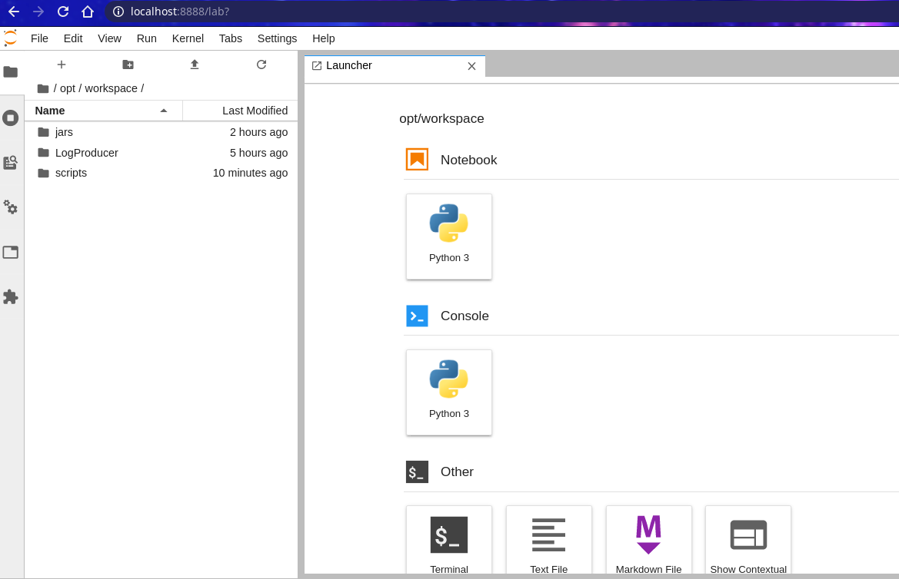

# GGTraceStreaming
`version`: 1.0  

## Mô tả   
### Mục đích
Project cho môn học big data, thực hiện mô phỏng hệ thống log dữ liệu của cụm máy chủ google, với bộ dữ liệu do google cung cấp, được mô tả đầy đủ ở [cluster-usage trace format schema](https://uni2u.tistory.com/attachment/cfile30.uf@26542633597592552C15C1.pdf).  
Hệ thống sẽ mô phỏng quá trình ghi lại thông tin trạng thái của tài nguyên được sử dụng trong datacenter, sau đó sử lý dữ liệu log bằng các công cụ hỗ trợ làm việc với dữ liệu lớn, cụ thể trong project này là hadoop, kafka, spark.  

### Kiến trúc hệ thống 
Về tổng quan, luồng dữ liệu được di chuyển theo thứ tự:  
1. Bộ mô phỏng sẽ lấy dữ liệu trạng thái của máy tính sẽ tạo ra dữ liệu log và gửi lên kafka server theo dạng streaming theo timestamp của bộ dữ liệu google trace.  
2. Bộ xử lý dữ liệu sẽ lấy dự liệu từ server kafka và xử lý theo kiến trúc lambda, từ là sẽ gồm 2 phần chính:  
    - Batch Layer: Nhận dữ liệu từ kafka server và lưu lại vào trong hệ thống hadoop  
    - Speech Layer: Xử lý real-time dữ liệu  
    

Dưới đây là component diagram của hệ thống:  


Ngoài ra, ta còn có thêm ModelTrainer để đưa ra các mô hình học nhằm phục vụ việc dữ đoán dữ liệu real-time ở SpeechLayer.

## Cài đặt 

Ta sẽ cài đặt hệ thống trên cụm docker container.

*Thông tin*  
kafka bootstrap server: kafka:9092  
hadoop default FS: hdfs://hadoop-namenode:8020  
spark master: spark://spark-master:7077   
spark master gui: localhost:8080  

### Yêu cầu 
docker-compose version >= 1.27.4
docker Engine >= 19.03.12

### Cài đặt cluster 

#### Tạo các image cần thiết
```bash
$bash build_images.sh
```
#### Hadoop Server 
*Tạo cụm hadoop*  

```bash
$cd BigDataCluster/hdfs_system/
$bash run.sh
```
Sau khi khởi động thế thông hdfs thì terminal sẽ chuyển đến terminal của hệ thống hadoop, tại đó, ta sẽ tạo thư mục cần thiết. 

*Tạo đường dẫn chứa dữ liệu*   

```
$hdfs dfs -mkdir /data  
$hdfs dfs -chmod 777 /data
```

#### Cài đặt cụm cho hệ thống 

*Mở một terminal khác đường dẫn ở project /GGTraceStreaming*

```bash
$cd /BigDataCluster
$docker-compose up
```

Truy cập localhost:8888 để vào jupyter lab, localhost:8080 để xem spark master   

Trong file browser của jupyter lab, mở folder ở đường dẫn _/opt/workspace/_  
Copy thư mục **jars**, **LogProducer** và **scripts** ở local *(GGTraceStreaming/)* vào thư mục workspace. *(Do không upload trực tiếp được thư mục nên có thể nén thành file zip rồi dùng unzip để giải nên, chú ý là trong Launcher có terminal)*  
Hình ảnh sau khi upload:   


#### Batch Processing  
Vào thư mục scripts  

```bash 
$cd /opt/workspace/scripts
```  

Chạy batch layer để chực nhận dữ liệu 

```bash 
$bash run-batch-layer.sh 
```  

Cần chạy LogProducer tạo ra dữ liệu  
Ta đang cần nhiều dữ liệu để lưu vào hệ thống nhằm phục vụ cho việc tạo model, nên ta sẽ đẩy nhanh quá trình này. Trong file run-logger.sh, sau lệnh python main là 2 số int, số thứ nhất là số lượng record được gửi trong một lần gửi lên kafka server, số thứ 2 là quãng thời gian giữa 2 lần gửi. Ở đây đang để là 3 5, ta sửa lại là 5000 5, và đợi khi nào gửi được khoảng 20000 record, tức 4 lần gửi thì dừng lại. 
Đây là quá trình khởi tạo dữ liệu cho việc xây dựng model, sau khi khởi tạo xong thì đặt lại tham số là 3 5 hoặc tùy ý, nhưng nhỏ thôi để dễ quan sát.  

*Chỉnh xong tham số thì chạy bộ mô phỏng gửi dữ liệu log.*  
```(Chú ý ta có thể mở nhiều terminal vì LogProducer và BatchLayer là chạy song song)```

```bash
$bash run-logger.sh
```

Sau khi nhận đủ dữ liệu (tức bộ LogProducer gửi được khoảng 20000 messages) thì dừng lại cả LogProducer và BatchLayer.  
Lúc này, dữ liệu của ta đã có ở trong thư mục /data/ trong hadoop, ta có thể xây dựng mô hình học.  
Cụ thể, ta xây dựng mô hình GMM bằng spark để phân loại các task. Mô hình sẽ được lưu ở /data/model/ trong hadoop.

```bash
$bash run-trainer.sh
```

Sau khi xây xong, console sẽ hiện thị lên như sau:  


Còn trong spark gui ở localhost:8888 thì ta thấy được một Job tên Trainer đã hoàn thành.  


#### Streaming Processing 
*Sau khi xây dựng model phân loại, ta sẽ dùng nó để dự đoán real time các task đến hệ thống*

Sửa lại tham số trong file run-logger.sh rồi chạy lại lệnh: 

```bash 
$bash run-logger.sh
```  
để thực hiện streaming dữ liệu.  

SpeechLayer, áp dụng mô hình học để dự đoán dữ liệu streaming real-time bằng spark.  

```bash
$bash run-speech-layer.sh
```

Kết quả sẽ hiện thị như sau:  


Tổng kết:  
* Hệ thống này là để mô phỏng quá trình xử lý dữ liếu streaming trong mô trường phân tán, với 1 cụm kafka, 1 cụm spark, 1 cụm hadoop.  
* Sử dụng spark stream, spark sql và spark mllib để xử lý phân tích dữ liệu. 


    
